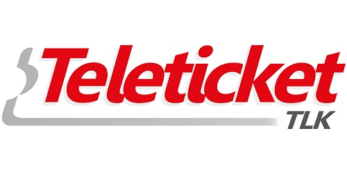

# Rediseño de la página de Teletickeet

## Desarrollado para:

[Laboratoria](http://www.laboratoria.la/)

## Descripción del proyecto:

Aplicar los procesos de investigación como UX Designer para optimizar el diseño de la página de Teleticket, mejorando el desempeño y animar a los usuarios a que se queden e investiguen más de los eventos que esta página promociona y vende al público.

# Etapas DCU (Diseño Centrado en el Usuario)

### A. Descubrimiento e Investigación.

Actividades:

1. Formulación de las preguntas para la entrevista con usuarios y encuesta online.

Para la formulación de entrevistas y encuestas, se ha pensado lo siguiente:

* ¿Cómo priorizar la información que se da a los usuarios en el landing page?

Es así como se llego a plantear preguntas que me permitieran conocer de que manera organizar la información de acuerdo a lo que el usuario más busca o tiene mayor preferencia al escoger un evento.

* Encuesta online [Ver encuesta](https://docs.google.com/forms/d/e/1FAIpQLSdj8Ffw1IMyD9e_eYjiEkOvNJ9byX2mnxafHbSzBP7A3Uoy7w/viewform?usp=sf_link)

* Preguntas para la entrevista con usuarios. [Ver documento](https://docs.google.com/document/d/1hp4pRSW91uJz8U5exG9--DuwU6Hvhr5Ms5C8aU0GdLQ/edit)

2. Entrevista con usuarios.

3. Encuesta online a través de Google Forms.

* Recolección de datos de las respuestas dadas en la encuesta.

### B. Síntesis y Definición.

Actividades:

1. Definir el problema:

* Se utilizó como herramienta el Diagrama de Afinidad.

    * Paso 1.- En post-its se colocó datos obtenidos en la encuesta y entrevista.

    * Paso 2: Separar en grupos por temas.

    * Paso 3: Priorizar los temas que se obtuvieron desde el punto de vista del usuario.

### C. Ideación.

1. Definición del user persona.

2. Definición de los Problems Statements.

3. Realización del Storyboard

### D. Prototipado.

Actividades:

1. Realización del prototipo.

### E. User Testing

Actividades: 

1. Realización del testing.

2. Feedback de usuarios.

### Presentación final.

[Ver presentación del prototipo final]().

