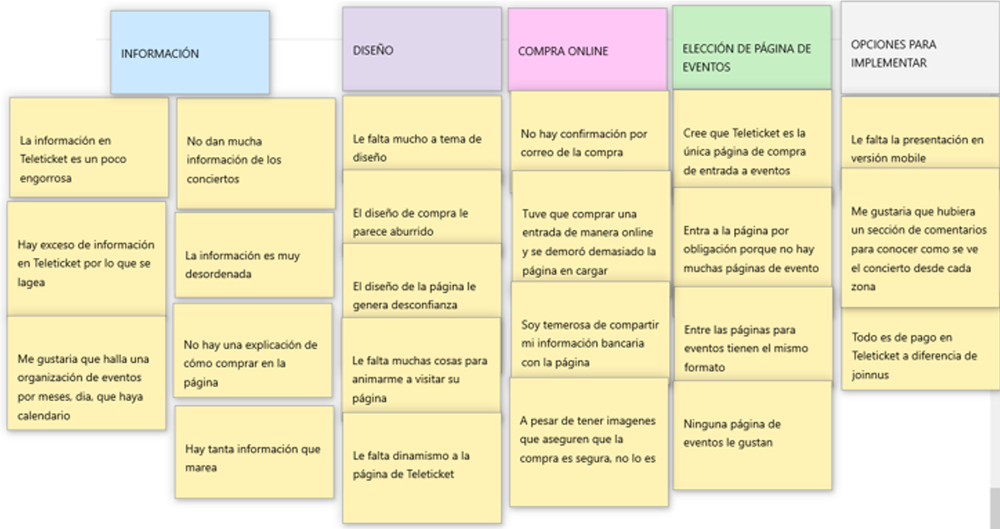

# Rediseño de la página de Teleticket

## Desarrollado para:

[Laboratoria](http://www.laboratoria.la/)

## Descripción del proyecto:

Aplicar los procesos de investigación como UX Designer para optimizar el diseño de la página de Teleticket, mejorando el desempeño y animar a los usuarios a que se queden e investiguen más de los eventos que esta página promociona y vende al público.

# Etapas DCU (Diseño Centrado en el Usuario)

### A. Descubrimiento e Investigación.

Actividades:

1. Formulación de las preguntas para la entrevista con usuarios y encuesta online.

* Encuesta online:

Para la formulación de las preguntas de la encuesta fue con intención de hallar que aspectos encuentra relevante el usuario al buscar un evento en una página web. 
Para luego, compararlo con las respuestas y encontrar que es lo que está funcionando mal con el diseño de la página.

[Ver encuesta](https://docs.google.com/forms/d/e/1FAIpQLSdj8Ffw1IMyD9e_eYjiEkOvNJ9byX2mnxafHbSzBP7A3Uoy7w/viewform?usp=sf_link)

* Preguntas para la entrevista con usuarios:

En esta etapa se profundiza más acerca de los problemas que encuentra el usuario al realizar su búsqueda o compra de entrada por páginas webs.

[Ver guía de entrevista](https://docs.google.com/document/d/1hp4pRSW91uJz8U5exG9--DuwU6Hvhr5Ms5C8aU0GdLQ/edit)

2. Entrevista con usuarios.

3. Encuesta online a través de Google Forms.

* Recolección de datos de las respuestas dadas en la encuesta.

### B. Síntesis y Definición.

Actividades:

1. Definir el problema:

Habiendo conocido que problemas enfrenta el usuario al adquirir una entrada en una página web, se realiza el **diagrama de afinidad**.

* Paso 1:

En post-its se colocó datos obtenidos en la entrevista.

* Paso 2: Separar en grupos por temas.

Aquí se pasa a agrupar por similitud de tema cada post-it , obteniendo cinco grupos:

    * Información.
    * Diseño.
    * Compra online.
    * Elección de página de eventos.
    * Opciones para implementar

* Paso 3: 

Priorizar los temas que se obtuvieron desde el punto de vista del usuario.
Se escoge estos temas, que es de acuerdo a los problemas que más frecuentan tener los usuarios.

### C. Ideación.

1. Definición del user persona.

Aquí se pasa a definir el user persona teniendo en cuenta los resultados más resaltantes en la encuesta.

2. Definición de los Problems Statements.

3. Realización del Storyboard

### D. Prototipado.

Actividades:

1. Realización del prototipo.

Prototipo 1.0:

En este prototipo, se ha querido simplicar la información que da Teleticket en su página, haciendo resaltar lo que un usario consumidor utiliza más de la página, que es buscar y comprar eventos.
Pero, no solo eso sino también priorizar el campo de puntos de pago para comprar de manera presencial y, para quienes son empresa o promotores incentivarlos también a vender sus entradas con Teleticket.
Identificando por último a información que detalla más cómo empresa en la sección de footer.

Entonces, el prototipo realizado es:
[Ver prototipo 1.0](https://marvelapp.com/2f07a58).

### E. User Testing

Actividades: 

1. Realización del testing.

**Protoripo 1.0**:

Se obtuvo los siguientes feedbacks:

* Excelente.
* Está bastante buena.
* En el buscador preferiria que estuviese tanto la opción de buscar por evento y el buscador por fechas.
* Preferiría buscar por nombre del evento.
* Se vé dinámico e interesante.

**Comparación de la página de teleticket y el prototipo 1.0**

Página actual de Teleticket:

Prototipo versión 1.0:

Prototipo final:

# Presentación final.

[Ver presentación del prototipo final](https://marvelapp.com/320516j).
